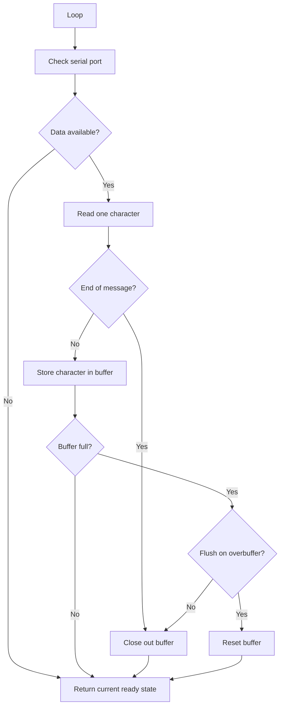

# serial_buffer

An Arduino helper for non-blocking UART buffering until complete serial messages are ready to process.

This project provides a small serial buffer helper for collecting incoming UART data without blocking the main loop. It watches a `HardwareSerial` port, stores received characters in a fixed-size buffer, and marks the buffer ready when an end-of-message character is received.

It was written for small embedded projects that need to handle serial data while continuing to run other loop-based logic.

## Project Status

Prototype / utility code.

This repo is intended as a lightweight helper for Arduino-style projects, not a fully featured serial protocol framework.

## Target Environment

This project is intended for:

* Arduino-compatible projects
* boards with one or more `HardwareSerial` ports
* UART / serial data streams
* short message-based serial input
* loop-based embedded firmware

The example sketch uses:

* `Serial`
* `Serial1`
* `Serial2`

Availability of `Serial1` and `Serial2` depends on the target board.

## What It Does

The helper can:

* monitor a serial port without blocking
* buffer incoming characters
* detect end-of-message characters
* mark a complete buffer as ready to send/process
* track message start time
* track message stop/lock time
* reset the buffer after processing
* optionally flush/reset if the buffer fills before an end-of-message is received

## Message Completion

A message is considered complete when one of the following characters is received:

| Character | Meaning         |
| --------- | --------------- |
| `\0`      | null terminator |
| `\n`      | newline         |
| `\r`      | carriage return |

When an end-of-message character is received, the buffer is locked and marked ready.

## Basic Flow



## Example Use

Include the helper:

```cpp
#include "serial_buffer.h"
```

Create one or more buffers:

```cpp
PhoenixJack_serialbuffer port0(&Serial);
PhoenixJack_serialbuffer port1(&Serial1);
PhoenixJack_serialbuffer port2(&Serial2);
```

Initialize the ports:

```cpp
void setup() {
  port0.init(115200, "basic buffer example\n\n");
  port1.init(115200);
  port2.init(9600);
}
```

Check the buffers in `loop()`:

```cpp
void loop() {
  if (port0.check()) {
    Serial.println(port0.buffer);
    port0.reset();
  }
}
```

## Example Sketch

The included example watches three serial ports:

| Buffer  | Port      | Purpose        |
| ------- | --------- | -------------- |
| `port0` | `Serial`  | Serial Monitor |
| `port1` | `Serial1` | Secondary UART |
| `port2` | `Serial2` | Third UART     |

When a complete message is received, the example prints:

* port number
* baud rate
* message start time
* message stop time
* buffered message contents

## Timing Support

The helper records:

| Function           | Purpose                                                            |
| ------------------ | ------------------------------------------------------------------ |
| `get_start_time()` | Returns the `millis()` value when the first character was received |
| `get_stop_time()`  | Returns the `millis()` value when the message was closed           |
| `get_baud_rate()`  | Returns the configured baud rate                                   |

This can help correlate serial messages with events elsewhere in the firmware.

## Buffer Size

The current maximum buffer size is:

```cpp
const uint8_t _max_buffer_size = 128;
```

Messages longer than this may either close the buffer or flush/reset it, depending on the `flush_on_overbuffer` setting.

## Handshake Concept

The helper uses internal flags modeled loosely after serial control concepts such as ready-to-receive and ready-to-send.

Current internal state includes:

* buffer ready to receive
* buffer ready to send
* buffer full
* remote clear-to-send placeholder

The remote clear-to-send behavior is not fully implemented yet. Treat it as a future extension point rather than complete hardware flow control.

## Repository Contents

| File                | Purpose                                    |
| ------------------- | ------------------------------------------ |
| `serial_buffer.ino` | Example sketch using multiple serial ports |
| `serial_buffer.h`   | Serial buffer helper                       |

## Suggested Arduino IDE Layout

The Arduino IDE expects the sketch folder and main `.ino` file to share the same name.

Recommended layout:

```text
serial_buffer/
├── serial_buffer.ino
├── serial_buffer.h
├── README.md
└── LICENSE
```

## Known Limitations

* Prototype utility code
* Fixed buffer size
* No dynamic allocation
* One message buffer per serial port object
* End-of-message detection is limited to null, newline, or carriage return
* Remote CTS/handshake support is not fully implemented
* Demo sketch assumes the target board supports `Serial1` and `Serial2`
* Demo output buffer is not protected with `snprintf()`
* No formal performance testing
* No warranty or support commitment

## Possible Future Improvements

Possible future improvements:

* rename class to a cleaner generic name
* make buffer size configurable
* add `available()`-style helper functions
* add `peek()` or safer buffer copy function
* use `snprintf()` in the example sketch
* add optional timeout-based message completion
* add optional CRC or checksum support
* add binary-safe message mode
* add configurable end-of-message characters
* finish remote CTS / ready-to-send handshake behavior
* add examples for boards with only one serial port
* add examples for forwarding between UARTs
* split implementation into `.h` and `.cpp` if the helper grows

## License

This project is released under the MIT License.

You are free to use, modify, and adapt it for your own projects. No warranty is provided, and no ongoing support or maintenance is implied.
